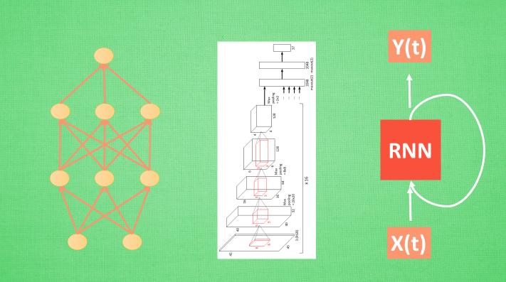
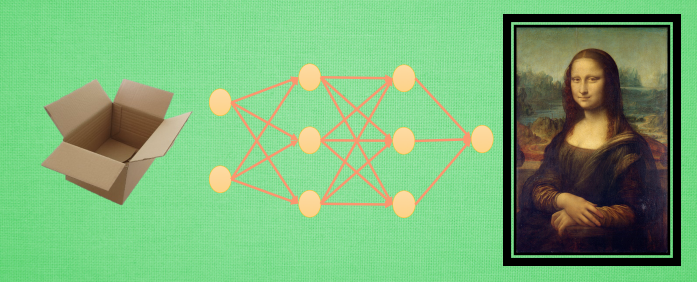
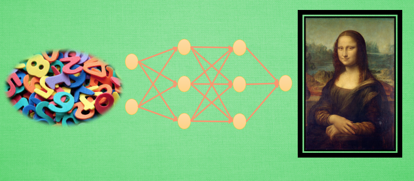
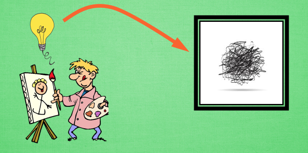
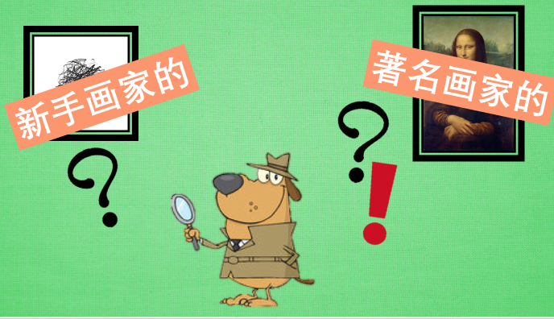
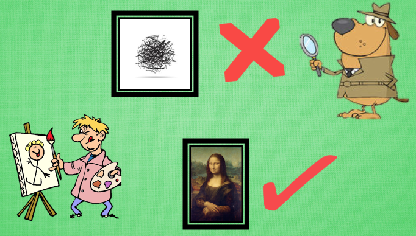
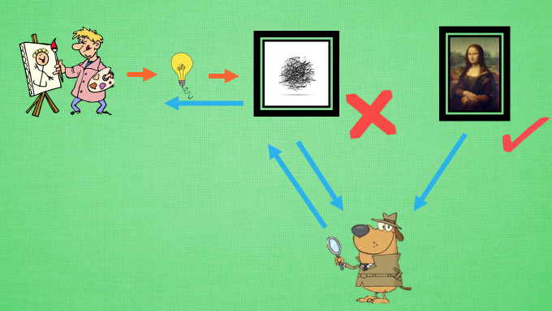
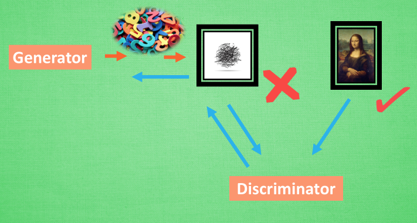
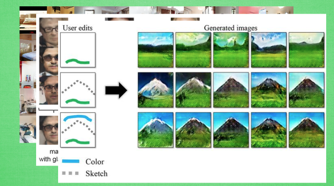

# 什么是GAN

## 1. 常见神经网络形式

神经网络分很多种, 有普通的前向传播神经网络 , 有分析图片的 CNN 卷积神经网络 , 有分析序列化数据, 比如语音的 RNN 循环神经网络 , 这些神经网络都是用来输入数据, 得到想要的结果, 我们看中的是这些神经网络能很好的将数据与结果通过某种关系联系起来.

## 2. 生成网络

但是还有另外一种形式的神经网络, 他不是用来把数据对应上结果的, 而是用来”凭空”捏造结果, 这就是我们要说的生成网络啦. GAN 就是其中的一种形式. 那么 GAN 是怎么做到的呢? 当然这里的”凭空”并不是什么都没有的空盒子, 而是一些随机数.

对, 你没听错, 我们就是用没有意义的随机数来生成有有意义的作品, 比如著名画作. 当然, 这还不是全部, 这只是一个 GAN 的一部分而已, 这一部分的神经网络我们可以想象成是一个新手画家.

## 3. 新手画家

画家作画都需要点灵感 , 他们都是依照自己的灵感来完成作品. 有了灵感不一定有用, 因为他的作画技术并没有我们想象得好, 画出来有可能是一团糟. 这可怎么办, 聪明的新手画家找到了自己的一个正在学鉴赏的好朋友 – 新手鉴赏家.

## 4. 新手鉴赏家

可是新手鉴赏家也没什么能耐, 他也不知道如何鉴赏著名画作 , 所以坐在电脑旁边的你实在看不下去了, 拿起几个标签往屏幕上一甩 , 然后新手鉴赏家就被你这样一次次的甩来甩去着甩乖了, 慢慢也学会了怎么样区分著名画家的画了. 重要的是, 新手鉴赏家和新手画家是好朋友, 他们总爱分享学习到的东西.

## 5. 新手鉴赏家和新手画家

所以新手鉴赏家告诉新手画家, “你的画实在太丑了, 你看看人家达芬奇, 你也学学它呀, 比如这里要多加一点, 这里要画淡一点.” 就这样, 新手鉴赏家将他从你这里所学到的知识都分享给了新手画家, 让好朋友新手画家也能越画越像达芬奇. 这就是 GAN 的整套流程, 我们在来理一下.

新手画家用随机灵感画画 , 新手鉴赏家会接收一些画作, 但是他不知道这是新手画家画的还是著名画家画的, 他说出他的判断, 你来纠正他的判断, 新手鉴赏家一边学如何判断, 一边告诉新手画家要怎么画才能画得更像著名画家, 新手画家就能学习到如何从自己的灵感画出更像著名画家的画了. GAN 也就这么回事.

## 6. GAN网络

Generator 会根据随机数来生成有意义的数据 , Discriminator 会学习如何判断哪些是真实数据 , 哪些是生成数据, 然后将学习的经验反向传递给 Generator, 让 Generator 能根据随机数生成更像真实数据的数据. 这样训练出来的 Generator 可以有很多用途, 比如最近有人就拿它来生成各种卧室的图片.

## 7. GAN应用

甚至你还能玩点新花样, 比如让图片来做加减法, 戴眼镜的男人 减去 男人 加上 女人, 他居然能生成 戴眼镜的女人的图片. 甚至还能根据你随便画的几笔草图来生成可能是你需要的蓝天白云大草地图片. 哈哈, 看起来机器也能有想象力啦. 如果你想试着动手做一个 GAN 的实践, 却不知道如何做, 不用担心, 我也为准备好了一个使用 Python 和他神经网络模块搭建的最简单的 GAN 实践代码. 欢迎大家访问莫烦 Python 了解更多机器学习的内容.
